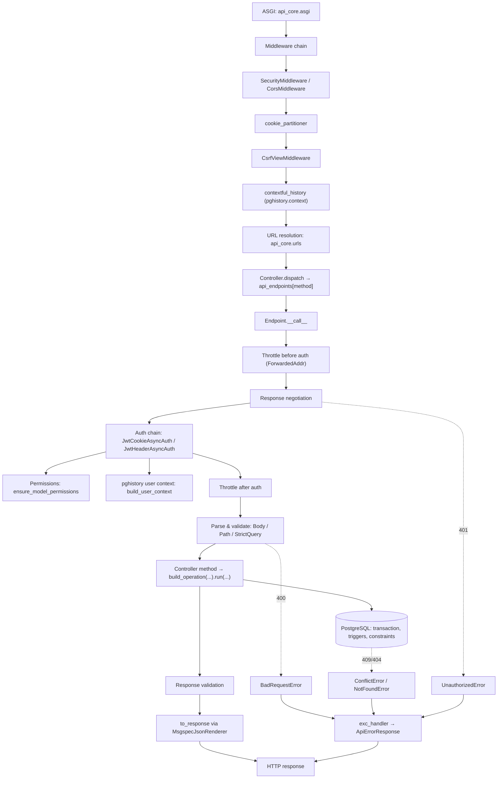

# Request lifecycle

One request, from the socket to the response body, naming the module
responsible at each hop.

## ASGI entrypoint

`api_core/asgi.py` sets `DJANGO_SETTINGS_MODULE` and hands the socket to
Django's own `get_asgi_application()`. Nothing in this template replaces
Django's ASGI handler; everything below happens inside Django middleware and
inside `dmr`'s controller dispatch.

## Middleware chain

Configured in `api_core.settings.MIDDLEWARE`, in this order:

1. `django.middleware.security.SecurityMiddleware`
2. `corsheaders.middleware.CorsMiddleware`
3. `api_middlewares.cookies.cookie_partitioner` — marks every outgoing cookie
   `Partitioned` when `CONFIG.cookie_secure` is on, so a browser will store it
   under [CHIPS](https://developer.mozilla.org/en-US/docs/Web/Privacy/Guides/Privacy_sandbox/Partitioned_cookies)
   partitioning.
4. `django.middleware.csrf.CsrfViewMiddleware` — stock Django CSRF cookie
   handling; the actual header check for authenticated requests happens later,
   inside auth (see [Authentication](#authentication-and-permissions)).
5. `api_middlewares.history.contextful_history` — for mutating methods
   (`POST`/`PUT`/`PATCH`/`DELETE`), opens a `pghistory.context(url=request.path)`
   block around the rest of the request. Everything written inside it —
   including the `user` context [attached during auth](#authentication-and-permissions) —
   ends up on the history row `pghistory` inserts for any tracked table
   (see [Database](database.md#history-tables)).

## Routing

Django resolves the url against `api_core.urls.urlpatterns`, which mounts
three hand-written paths (`api-root`, `health/`, `openapi/`) ahead of
`router.urls` — the urls generated by `route_controllers` for every app router
included into `api_core.api.router` (currently just `api_auth.api.router`; a
new domain app adds its own router the same way). See [Routing](routing.md)
for how a controller class turns into that pattern in the first place.

The resolved view is always `SomeController.as_view()`. `dmr.Controller.dispatch`
looks up `self.api_endpoints[request.method]` — a dict built once at class
creation time, method name to `Endpoint` instance — and calls it, or answers
`405` via `handle_method_not_allowed` (overridden by `api_core.controllers.mixins.HandleNotAllowedMixin`
so the `405` body matches this template's error shape) if the method has no
handler.

## Throttling and authentication

Inside `Endpoint.__call__`, before the controller method ever runs:

1. **Throttling before auth.** `BaseController.throttling` (three
   `AsyncThrottle`s: 10/s, 100/min, 1000/h, built by `api_core.controllers.throttles.build_throttle`)
   key on `ForwardedAddr` — `X-Forwarded-For` (last hop) or `REMOTE_ADDR` — so
   an anonymous client can already be rate-limited before it has proven who it
   is. `runs_before_auth = True` is what puts them here instead of after.
2. **Response negotiation.** `Accept` is matched against `renderers`
   (`MsgspecJsonRenderer`); a client asking for something else gets
   `NotAcceptableError`, mapped to `UnacceptableHeaderError` (`406`).
3. **Auth.** `BaseController.auth` tries `JwtCookieAsyncAuth`, then
   `JwtHeaderAsyncAuth` (see [`api/authentication.md`](../api/authentication.md)).
   Both funnel through `JwtRbacAsyncAuth.__call__`, which — after `dmr` has
   decoded the token, checked its claims and loaded the user — also checks the
   session isn't blocklisted, runs `ensure_model_permissions` (per-method
   Django permission checks; see [permissions](../guides/permissions.md)), and
   calls `build_user_context` to attach the authenticated user to the
   `pghistory` context opened by the history middleware. If every auth in the
   sequence returns `None`, `NotAuthenticatedError` is raised (`401`). This is
   why permissions run _inside_ auth rather than as a separate step: by the
   time a permission is checked, the request already has a concrete user.
4. **Throttling after auth.** A second, per-endpoint throttle round can key on
   things only known after authentication (e.g. the user id) — none of the
   default controllers in this template use it, but the hook exists.

## Parsing and validation

`Endpoint._serializer_context` resolves each parameter the controller method
asks for — `Body[...]`, `Path[...]`, `StrictQuery[...]`, cookies, headers —
against the request, using the schema layer described in [Schemas](schemas.md).
Anything that fails validation raises a `pydantic.ValidationError` or
`dmr.errors.ValidationError` before the method body ever runs; see
[Errors](errors.md) for how those become field-level `400` responses.
`StrictQueryComponent` (`api_core.controllers.components`) additionally
rejects a repeated query parameter before `dmr`'s own query parsing runs.

## The operation, inside its transaction

Once parsed, the controller method builds an operation with
`self.build_operation(...)` and calls `.run(...)` on it. This is the only
place the database is touched — see [Operations](operations.md) for the
`dump`/`execute`/`map` contract and where the transaction boundary sits. A
`django.db.IntegrityError` raised here (a trigger or constraint refusing the
write) propagates up to the error handler rather than being caught locally.

## Serialization and response validation

The operation returns a DTO (or, for lists, a paginated envelope). `dmr`
validates it against the endpoint's declared return type
(`response_validator.validate_modification`) and turns it into an
`HttpResponse` via `controller.to_response`, using the negotiated renderer
(`MsgspecJsonRenderer`). If validation fails here instead — the return value
doesn't match what the endpoint promised — that is a bug in the operation or
schema, not a client error, and surfaces as a `ResponseSchemaError`.

## Where errors become payloads

Two paths lead to an error response:

- **`ApiError` / `RedirectTo`**, raised directly by application code (schemas,
  operations, auth), are caught right inside `Endpoint._async_endpoint` and
  turned into a response immediately.
- **Everything else** — `dmr` exceptions, Django/psycopg exceptions, anything
  unexpected — falls through to `Endpoint.handle_async_error`, which tries a
  per-endpoint handler, then `controller.handle_async_error`, then the global
  handler registered as `Settings.global_error_handler`:
  `api_exceptions.handler.exc_handler`. That function is the single place
  mapping these onto `ApiError` subclasses; see [Errors](errors.md).

## The whole path

